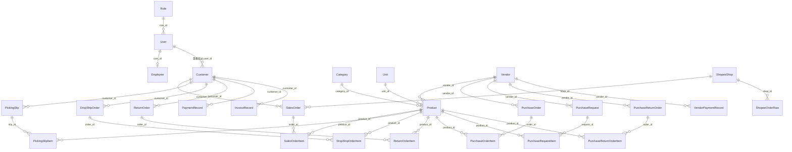

# 雲端進銷存系統

將本機端 ERP（Flask + SQLite）雲端化，並與蝦皮出貨工作台（Chrome 擴充功能）直接串接，讓進貨、銷貨、庫存、財務、蝦皮訂單同步都在雲端集中管理。

技術棧：Flask 3 + SQLAlchemy + Flask-Login + Flask-Migrate，開發環境用 SQLite、正式環境用 PostgreSQL（Railway 部署）。

## 目前狀態

**核心進銷存業務邏輯已經完整搬遷並可運作**：登入權限、商品/供應商/客戶/員工基礎資料、銷售（銷貨/揀貨/代出貨/退貨）、採購（進貨/請購/退出）、財務（應收應付/發票/固定支出/每日收支預估）全部都已實作，不是佔位頁。蝦皮串接目前只做到「擴充功能推送訂單原始資料 → 落地保存」，尚未串上真正的 `SalesOrder` 轉換與庫存扣減。

## 產品功能

### 1. 帳號與權限
- 帳號登入/登出（Flask-Login），`admin` 帳號擁有所有權限，不受角色限制
- 角色（`Role`）以功能模組為單位設定權限：商品、供應商、客戶、銷售、採購、員工、財務
- 員工管理：建立角色、建立使用者帳號並綁定員工姓名
- 自助修改密碼
- PDA 模式（`/pda`）：精簡版介面，供行動裝置揀貨/查詢使用
- 業務角色（角色名稱含「業務」）登入首頁會顯示簡化版儀表板（`index_pda.html`）

### 2. 基礎資料管理
- **商品**：條碼、雙自編碼（`code1`/`code2`）、分類、單位、供應商綁定、成本/售價、安全庫存、上下架狀態
  - 商品搜尋 API（供表單即時查詢）、依條碼/自編碼查單品
  - 商品列表可依名稱/條碼/狀態篩選，並顯示累計銷售量/採購量
  - Excel 匯出商品清單（含銷售/採購統計）、下載匯入範本、批次匯入（自動建立缺少的分類/單位、依供應商簡稱比對、略過重複條碼）
- **供應商** / **客戶**：完整聯絡資訊、稅籍、銀行帳戶、結帳日/付款日、客戶專屬折扣（`price_discount`/`post_discount`）、供應商三階梯量價（`t1`~`t3`）
- **公司設定**：公司抬頭、統編、地址、每月結帳日，用於報表與單據列印
- **新品報價單引擎**（`/quotation`）：依商品上架日期區間篩選新品，產生給特定客戶的報價單

### 3. 銷售模組
- **揀貨單**：先建立揀貨單（不影響庫存），供出貨前備貨
- **銷貨單**：開單即時扣庫存，自動判斷「現金價」品項與一般價分開計算毛利（依客戶月結折扣 `post_discount` 只套用在非現金價部分），單號規則 `S+日期+流水號`
- **揀貨轉銷貨**（`convert_to_sales` / `finalize_sales`）：揀貨單出貨完成後正式轉入帳銷貨單
- **代出貨單（DropShip）**：客戶指定商品由廠商直接出貨，狀態 `pending`/`converted`
  - **轉單功能**：一鍵將代出貨單依商品所屬供應商拆分，自動產生對應銷貨單（給客戶）與多張進貨單（給各廠商），庫存互相抵銷不影響帳面存貨
- **銷貨退回**：退貨不影響庫存（庫存維持不變，only 帳務層面抵扣應收/應付），區分現金價/一般價金額
- **銷貨單編輯/作廢**：編輯會先歸還庫存再依新內容重新扣庫存並重算毛利；作廢會歸還庫存
- **列印**：揀貨單、銷貨單（出貨憑證/客戶簽收用）

### 4. 採購模組
- **進貨單**：開單即時加庫存並更新商品成本（`Product.cost` 以最新進貨價覆蓋），單號規則 `P+日期+流水號`
- **進貨退出**：退貨扣減庫存，抵扣應付帳款
- **請購單（PR）**：向供應商叫貨的請購紀錄，可列印
- **進貨單編輯/作廢**：編輯會先扣回庫存再依新內容重新加庫存；作廢會扣回庫存

### 5. 財務模組
- **應收帳款**（`/receivables`）：依年月彙總每位客戶的應收（分現金價/一般價）、退貨抵扣、已收款，並依負責業務（客戶綁定的使用者/員工）分組彙總；支援登錄收款
- **應付帳款**（`/payables`）：依供應商結帳日+付款天數計算「預計付款日」落在指定區間的應付帳款，扣除退貨與已付款；支援登錄付款
- **對帳單**（客戶/供應商）：計算「上期餘額 + 本期應收/應付 - 本期已收/付款」的期初期末結轉，可列印正式對帳單
- **發票管理**：依月份彙算需開發票客戶（`has_invoice=True`）的應開金額（套用客戶折扣），可手動調整並儲存發票紀錄、標記列印、作廢
- **固定支出**：每月固定日期的支出項目（房租、薪資等）
- **每日收支預估表**（`/monthly_finance`）：把當月固定支出、依客戶付款日推估的應收現金流、依供應商付款日推估的應付現金流，攤到每一天，計算每日淨額與累積結餘

### 6. 首頁儀表板（`/`）
- 待處理揀貨單、待處理代出貨單、低於安全庫存的商品清單
- 今日營收（`admin` 才看得到今日毛利）
- 近 7 天營收趨勢、本結帳月熱銷商品 Top 5（皆限 `admin`）
- 本結帳月營收與採購總額（限 `admin`）
- 公告欄（可發布/編輯/刪除圖文公告，圖片自動壓縮為 800px 寬 JPEG）

### 7. 蝦皮工作台串接（進行中）
新增一組給 Chrome 擴充功能呼叫的 REST API，用每個蝦皮賣場專屬的 API Key（`X-API-Key` header）驗證：

| Endpoint | 說明 |
|---|---|
| `GET /api/shopee/ping` | 測試連線 + API Key 是否有效 |
| `POST /api/shopee/orders/sync` | 推送待出貨訂單原始資料，依 `shop_id` + `order_sn` upsert 落地保存到 `ShopeeOrderRaw`（**目前只落地保存，尚未轉換成正式 `SalesOrder` 或扣庫存**） |

`SalesOrder` 已預留 `source`（manual/shopee）、`status`、`shop_id`、`shopee_order_sn`、`shopee_package_number` 欄位，`Product` 已預留 `shopee_item_id`/`shopee_model_id` 欄位供未來比對商品用——資料模型已就緒，業務邏輯待下一階段實作。

## 系統架構

```
shopee/
├── app.py                     # Flask app factory + 入口；登入/登出/首頁/公告/修改密碼/共用比價 API 都在這裡
├── config.py                  # 讀 DATABASE_URL（沒設就退回本機 SQLite），SECRET_KEY
├── extensions.py               # db / login_manager / migrate 共用實例（避免 circular import）
├── models.py                   # 全部 SQLAlchemy models
├── routes/
│   ├── basics.py               # 商品/供應商/客戶/員工/公司設定/報價單/Excel 匯入匯出
│   ├── sales.py                 # 揀貨單/銷貨單/代出貨單/銷貨退回 + 轉單邏輯
│   ├── purchases.py             # 進貨單/進貨退出/請購單
│   ├── finance.py               # 應收/應付/對帳單/發票/固定支出/每日收支預估
│   └── api_shopee.py            # 蝦皮工作台對接 API（ping / orders/sync）
├── templates/                   # Jinja2 模板（45 個檔案：列表頁、表單頁、各式單據列印頁）
├── migrations/                  # Flask-Migrate (Alembic) 資料庫遷移紀錄
├── scripts/seed.py              # 建表 + 建立第一個管理員帳號
├── requirements.txt
├── .env.example
└── Procfile                     # Railway 部署用（web: gunicorn app:app / release: flask db upgrade）
```

## 程式碼框架結構

### App Factory + 依賴注入

`app.py` 用 `create_app(config_class=Config)` 這個 factory function 組裝整個應用，而不是在 import 時就建立全域 `app`：

```python
def create_app(config_class=Config):
    app = Flask(__name__)
    app.config.from_object(config_class)

    db.init_app(app)              # extensions.py 的共用實例，這裡才綁定到 app
    migrate.init_app(app, db)
    login_manager.init_app(app)

    import models                 # 確保 models 在 migrate 之前被載入（否則 flask db 系列指令看不到 table）
    ...
```

**擴充套件先建立、後綁定**（`extensions.py` → `db = SQLAlchemy()` 不帶 `app` 參數，在 factory 裡才 `db.init_app(app)`）是為了避免 `models.py`、`routes/*.py`、`app.py` 之間互相 import 造成 circular import。

**業務模組不是 Blueprint，而是「函式 + 依賴注入」**：`routes/sales.py`、`purchases.py`、`finance.py`、`basics.py` 各自匯出一個 `register_*_routes(app, ...)` 函式，直接把路由註冊到傳進來的 `app` 上（用的還是 `@app.route`，不是 `@blueprint.route`）。`create_app()` 裡把幾個橫跨模組共用的東西當參數傳進去：

```python
order_lock = threading.Lock()                      # 全模組共用同一把鎖，防止單號重複
register_basics_routes(app, permission_required)
register_sales_routes(app, permission_required, order_lock, get_current_billing_period, calc_billing_year)
register_purchases_routes(app, permission_required, order_lock, get_current_billing_period, calc_billing_year)
register_finance_routes(app, permission_required)
```

- `permission_required(perm)`：decorator 工廠，檢查 `current_user.role_ref` 是否有 `p_{perm}` 權限（`admin` 帳號略過檢查），定義在 `app.py`，逐一傳給四個模組使用
- `order_lock`：`threading.Lock()` 單一實例，銷售/採購模組開單時共用，避免併發產生重複單號
- `get_current_billing_period` / `calc_billing_year`：結帳月計算的共用函式，定義在 `app.py`，供銷售/採購模組決定單據該歸在哪個結帳年月

只有蝦皮 API 是例外：`routes/api_shopee.py` 用標準 Flask **Blueprint**（`api_shopee_bp = Blueprint("api_shopee", __name__, url_prefix="/api/shopee")`），在 `create_app()` 尾端用 `app.register_blueprint(api_shopee_bp)` 註冊——因為它是獨立於既有 ERP 邏輯之外新增的模組，不需要共用 `order_lock` 等既有依賴。

### 請求生命週期
1. **認證**：`flask_login` 的 `@login_manager.user_loader` 從 session 還原 `User`；未登入訪問 `@login_required` 路由會被導去 `/login`
2. **授權**：需要模組權限的路由再疊一層 `@permission_required('sales')` 等 decorator，檢查該使用者角色的對應布林欄位（`Role.p_sales` 等）
3. **業務邏輯**：各 `routes/*.py` 內直接操作 `db.session`，走完 ORM 增刪改查後 `db.session.commit()`
4. **回應**：頁面路由 `render_template(...)` 回傳 Jinja2 模板；少數提供給前端 JS 用的路由回傳 `jsonify(...)`（如商品搜尋、比價 API、發票儲存）

### 資料模型（`models.py`）— 完整欄位

#### 帳號與權限
| Model | 欄位 |
|---|---|
| `Role` | `id`, `name`（唯一）, `p_products`, `p_vendors`, `p_customers`, `p_sales`, `p_purchases`, `p_employees`, `p_finance`（各模組權限布林值） |
| `User` | `id`, `username`（唯一）, `password`（雜湊）, `role_id` → `Role` |
| `Employee` | `id`, `emp_no`（唯一）, `name`, `user_id` → `User`（1:1） |

#### 基礎資料
| Model | 欄位 |
|---|---|
| `Category` | `id`, `name`（唯一） |
| `Unit` | `id`, `name`（唯一） |
| `Vendor` | `id`, `vendor_no`（唯一）, `full_name`, `short_name`, `tax_id`, `phone`, `fax`, `contact_person`, `bank_account`, `warehouse_address`, `closing_day`（預設20）, `payment_day`（預設30）, `t1_amt`/`t1_dis`, `t2_amt`/`t2_dis`, `t3_amt`/`t3_dis`（三階梯量價） |
| `Customer` | `id`, `cust_no`（唯一）, `full_name`, `short_name`, `tax_id`, `phone`, `mobile`, `fax`, `contact_person`, `bank_account`, `shipping_address`, `invoice_address`, `closing_day`, `payment_day`, `price_discount`（預設0.6）, `post_discount`（月結折扣%）, `has_invoice`, `user_id` → `User`（負責業務） |
| `Product` | `id`, `barcode`（唯一）, `name`, `code1`, `code2`, `cost`, `price`, `safety_stock`, `stock`, `is_active`, `category_id` → `Category`, `unit_id` → `Unit`, `vendor_id` → `Vendor`, `shopee_item_id`（索引）, `shopee_model_id`（索引）, `created_at` |
| `CompanyProfile` | `id`, `name`, `short_name`, `tax_id`, `phone`, `fax`, `address`, `bank_account`, `contact_person`, `closing_day`（預設31） |

#### 銷售
| Model | 欄位 |
|---|---|
| `PickingSlip` | `id`, `slip_no`（唯一）, `date`, `status`（預設pending）, `customer_id` → `Customer`, `items` → `PickingSlipItem`（cascade delete） |
| `PickingSlipItem` | `id`, `slip_id` → `PickingSlip`, `product_id` → `Product`, `qty` |
| `SalesOrder` | `id`, `order_no`（唯一）, `date`, `billing_year`, `billing_month`, `customer_id` → `Customer`, `total_amount`, `gross_profit`, `source`（manual/shopee）, `status`（pending/shipped/cancelled）, `shop_id` → `ShopeeShop`, `shopee_order_sn`（索引）, `shopee_package_number`（索引）, `items` → `SalesOrderItem` |
| `SalesOrderItem` | `id`, `order_id` → `SalesOrder`, `product_id` → `Product`, `qty`, `price`, `cost`, `remark`（含「現金價」文字時視為現金交易） |
| `DropShipOrder` | `id`, `order_no`（唯一）, `date`, `billing_year`, `billing_month`, `status`（預設pending）, `customer_id` → `Customer`, `items` → `DropShipOrderItem` |
| `DropShipOrderItem` | `id`, `order_id` → `DropShipOrder`, `product_id` → `Product`, `qty`, `remark` |
| `ReturnOrder` | `id`, `order_no`（唯一）, `date`, `billing_year`, `billing_month`, `customer_id` → `Customer`, `total_return_amount`, `total_cost_amount`, `items` → `ReturnOrderItem` |
| `ReturnOrderItem` | `id`, `order_id` → `ReturnOrder`, `product_id` → `Product`, `qty`, `price`, `cost`, `remark` |

#### 採購
| Model | 欄位 |
|---|---|
| `PurchaseOrder` | `id`, `order_no`（唯一）, `date`, `billing_year`, `billing_month`, `vendor_id` → `Vendor`, `total_amount`, `items` → `PurchaseOrderItem` |
| `PurchaseOrderItem` | `id`, `order_id` → `PurchaseOrder`, `product_id` → `Product`, `qty`, `price` |
| `PurchaseRequest` | `id`, `req_no`（唯一）, `date`, `billing_year`, `billing_month`, `vendor_id` → `Vendor`, `items` → `PurchaseRequestItem` |
| `PurchaseRequestItem` | `id`, `request_id` → `PurchaseRequest`, `product_id` → `Product`, `qty` |
| `PurchaseReturnOrder` | `id`, `order_no`（唯一）, `date`, `billing_year`, `billing_month`, `vendor_id` → `Vendor`, `total_return_amount`, `items` → `PurchaseReturnOrderItem` |
| `PurchaseReturnOrderItem` | `id`, `order_id` → `PurchaseReturnOrder`, `product_id` → `Product`, `qty`, `price`, `remark` |

#### 財務
| Model | 欄位 |
|---|---|
| `PaymentRecord` | `id`, `customer_id` → `Customer`, `billing_year`, `billing_month`, `amount`, `method`, `date` |
| `VendorPaymentRecord` | `id`, `vendor_id` → `Vendor`, `billing_year`, `billing_month`, `amount`, `method`, `date` |
| `InvoiceRecord` | `id`, `customer_id` → `Customer`, `billing_year`, `billing_month`, `invoice_date`, `amount`, `is_printed` |
| `FixedExpense` | `id`, `day`, `name`, `amount`, `remark` |

#### 其他 / 蝦皮串接
| Model | 欄位 |
|---|---|
| `Announcement` | `id`, `title`, `content`, `date`, `image_filename` |
| `ShopeeShop` | `id`, `name`, `platform_shop_id`（唯一，蝦皮的 shop_id）, `api_key`（唯一）, `is_active`, `created_at` |
| `ShopeeOrderRaw` | `id`, `shop_id` → `ShopeeShop`, `order_sn`（索引）, `package_number`, `payload`（JSON）, `received_at`, `processed`；`(shop_id, order_sn)` 唯一約束 |

### ER 圖（主要關聯）



### 關鍵業務規則
- **單號命名規則**：銷貨單 `S`、進貨單 `P`、退貨單 `R`、進貨退出 `PRT`、請購單 `PR`、代出貨單 `DS` + 日期（`YYMMDD`）+ 3 碼流水號
- **並發保護**：開單流程用 `threading.Lock()`（`order_lock`）避免同時開單造成單號重複
- **結帳月（billing period）**：依 `CompanyProfile.closing_day` 判斷「今天」屬於哪個結帳月，超過結帳日就算下個月；`calc_billing_year` 處理手動指定月份時年份的推算（跨年容錯 ±6 個月）
- **現金價/一般價**：品項備註含「現金價」文字會被視為現金交易，不套用客戶月結折扣（`post_discount`），其餘品項才套用
- **毛利計算**：`gross_profit = 一般價毛利 * (1 - 客戶月結折扣%) + 現金價毛利`（現金價毛利不打折）
- **庫存連動**：銷貨/退出扣庫存，進貨/退回加庫存；編輯與作廢單據都會先復原庫存再套用新內容，確保庫存永遠反映「目前有效單據」的加總

## 開發環境設置

```bash
python -m venv .venv
./.venv/Scripts/python -m pip install -r requirements.txt
cp .env.example .env          # 本機開發可以不改，會自動用 SQLite

./.venv/Scripts/python scripts/seed.py   # 建表 + 建立管理員帳號 admin/admin123
./.venv/Scripts/python app.py             # 開發伺服器，預設 http://localhost:5000
```

部署到 Railway 時：新增一個 PostgreSQL 服務（Railway 會自動注入 `DATABASE_URL`），
設定 `SECRET_KEY` 環境變數，Railway 會用 `Procfile` 的 `web` / `release` 指令啟動
（`release` 會先跑 `flask db upgrade` 套用 migrations）。

## 開發階段規劃

1. ~~**第一階段：雲端化既有 ERP**~~ ✅ 已完成
   資料庫改用 PostgreSQL、部署到雲端主機，登入、商品、銷貨、採購、財務功能都已在雲端正常運作。
2. **第二階段：蝦皮同步 API**（進行中）
   `/api/shopee/*` 端點與 API Key 機制已建立，`ShopeeOrderRaw` 落地保存已可動；
   尚待實作：`ShopeeOrderRaw` → 正式 `SalesOrder` 的轉換（商品比對 `item_id`/`model_id` → `Product.shopee_item_id`/`shopee_model_id`、扣庫存、成本/毛利計算）。
3. **第三階段：出貨回寫與多店鋪管理**
   出貨結果回寫（物流單號、出貨狀態）、多店鋪視覺化管理、低庫存警示強化、毛利報表強化。
4. **第四階段（視需求）**：前端現代化（React/Next.js）、更多通路整合。

## 待確認事項

- 蝦皮擴充功能的 API Key 要怎麼發放與儲存（目前規劃：每個蝦皮賣場一把，存在 `chrome.storage.local`）
- `ShopeeOrderRaw` 轉正式 `SalesOrder`（商品比對、扣庫存、成本計算）的業務規則
- 多店鋪情境下，商品與庫存要分店鋪還是共用

## 授權

內部使用專案，未定義開源授權條款。
